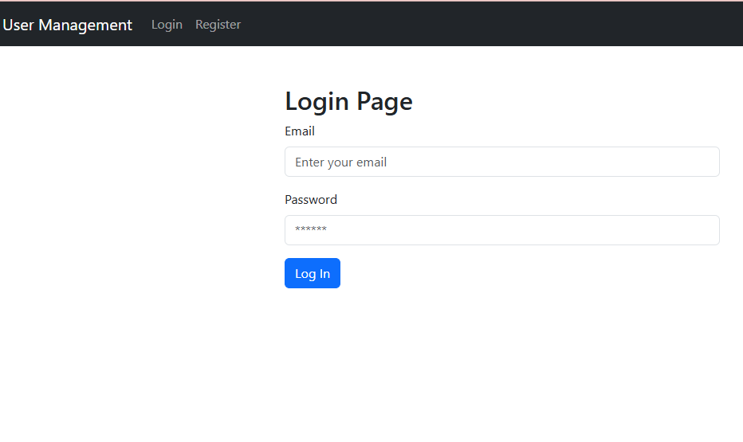
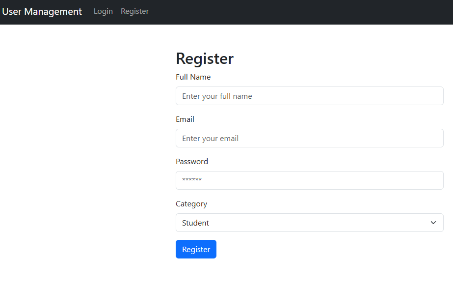
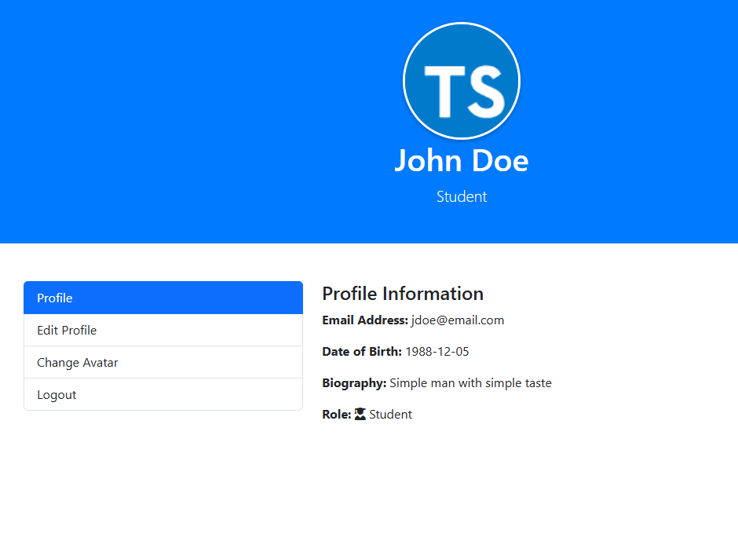

This is a practice project for a user management system with Go, HTMX and MySQL.
You can register a new user, login, change your profile information as well as upload avatar pictures.
The information is saved to a database (MySQL).

### Login Page

### Register Page

### Profile Page
